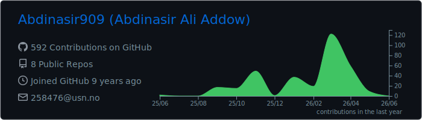
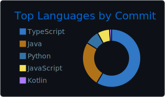
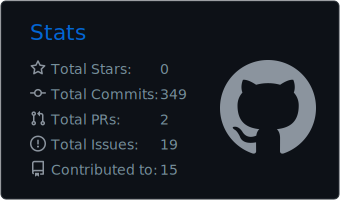
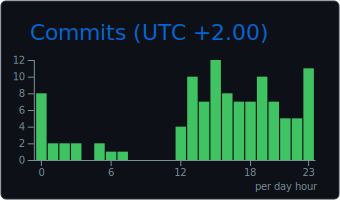
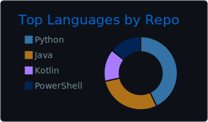

<h1 align="center">Hello! Welcome to my GitHub 👋</h1>

  

  
  

  
  

<!-- GitHub Stats med alle commits inkludert -->

  

<!-- Streak stats (viser alle commits inkl. private og org-repos) -->

  

  
  
  

